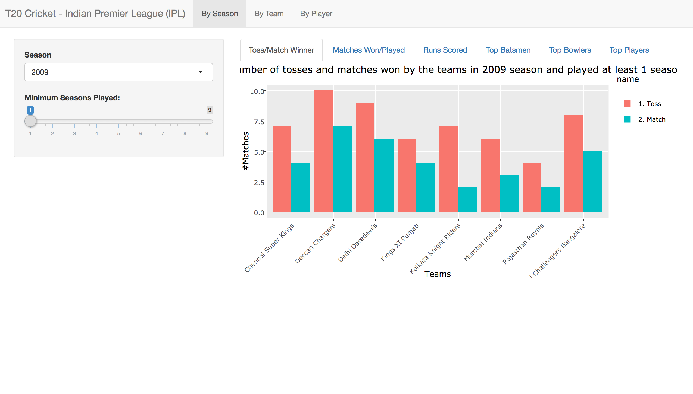
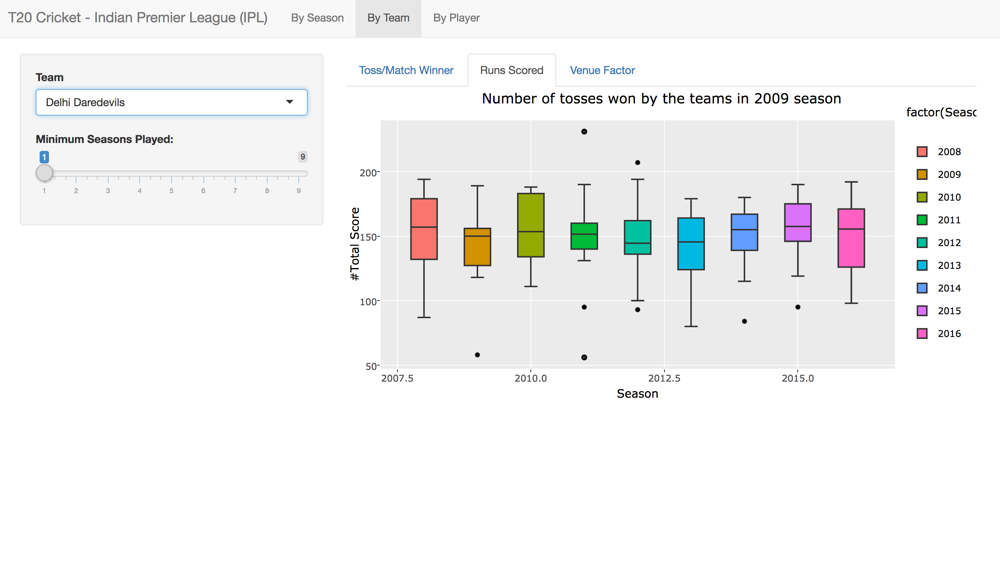
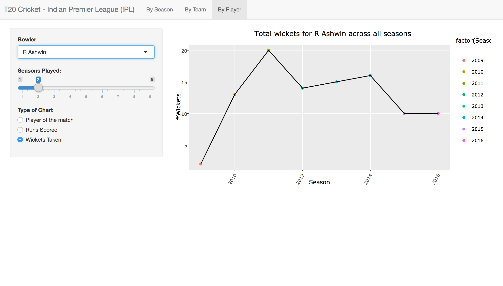

# Indian Premier League (IPL) data visulization and analysis 
**Introduction**

Cricket is one of the most popular and played sports in India. There are three standard types of cricket matches, Five-day match (Test Match), 50 overs match (One day match), and Twenty overs match (T20). Although all formats are quite popular but during the last decade, the popularity of the T20 matches has increased exponentially. The main reason for the popularity of T20 matches is more action in short time. The introduction of various T20 tournaments has also added to its popularity. Indian Premier League (IPL) is the biggest event among all the T20 tournaments across the globe. It is an annual tournament and consists of two stages. In the first or the league stage, each team plays against the other team twice. In the second stage, the top four teams after the league stage compete for the title. We are going to use the IPL data from the year 2008 to 2016. The raw data is available at [Cricsheet website](http://cricsheet.org/downloads/). The raw data consists ball by ball details individually for every match (577 files). The processed data has been downloaded from [Kaggle](https://www.kaggle.com/manasgarg/ipl). For carrying out the analysis we have divided this project into two parts. In the first part, we will further process the data so that it can be used for the next part (visualization and analysis). In the next part, we will develop a shiny application in which the data can be analyzed by plotting and changing various parameters including year, team, and player.

**Requirement**

You need R version above 3.0 to run this application. In addition, this package requires the following packages.
* `dplyr`
* `tidyr`
* `shiny`
* `ggmap`
* `rworldmap`
* `ggplot`
* `plotly`
* `ggrepel`

**How to run the shiny app**

* Download or fork the github repository.
* Open the R terminal.
* Set the current path of the directory to the shiny application for example `setwd("/Users/jain/STAT585/STAT585-FinalProject/shiny")`
* Run Application by typing `runApp()`

**IPL seasons analysis**

In this section, the user can visualize and analyze the data grouped together by the season. The user can use various plots which are described below for a specific season by selecting the season in the select widget. In addition to that, the user can also filter the teams or players by selecting the minimum number of seasons played through the slider bar. For example, the following plot compares the count of toss and matches winner across different teams in a season. The information is displayed as a histogram. This plot can be used to see the effect of winning the toss on the match result for teams. The user can also hover over the bars and get the details.

**Team performance analysis**

In this section, the user can visualize and analyze the data grouped together for a team across all seasons. The user can use various plots which are described below for a team by selecting the team in the select widget. In addition to that, the user can also filter the teams by selecting the minimum number of seasons played through the slider bar (Automatic update of team select widget). Now we talk about the different plots that are there for this. The shiny page for the team analysis is shown below. 

**Player's performance analysis**

In this section, the user can visualize and analyze the data grouped for a player across all seasons. The user can use various plots which are described below for a player to analyze his performance by selecting the player in the select widget. In addition to that, the user can also filter the players by selecting the minimum number of seasons played through the slider bar (Automatic update of the player select widget). The shiny page for the player analysis is shown below. 

