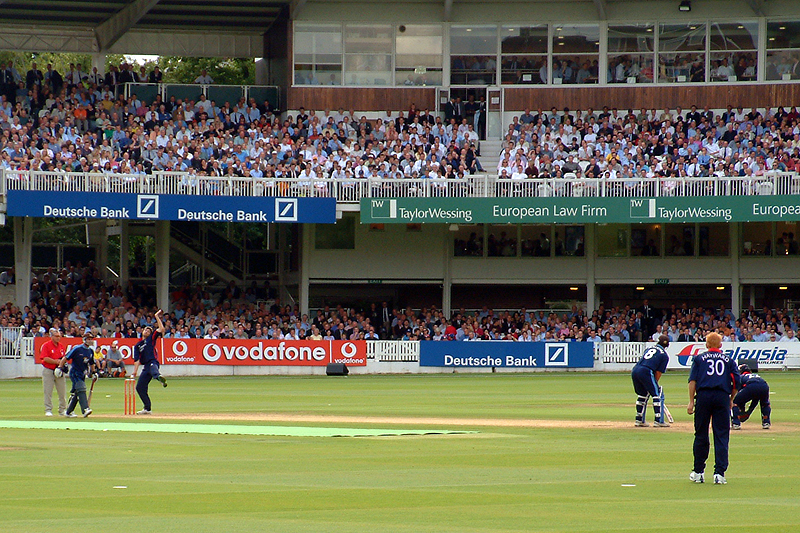
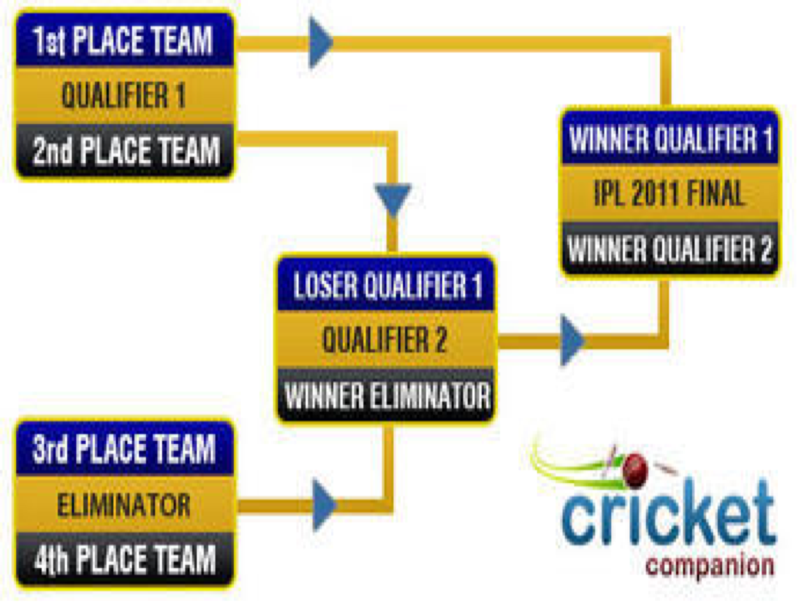

```{r setup, include=FALSE}
knitr::opts_chunk$set(
    echo = TRUE,
    message = FALSE,
    warning = FALSE
)
library("tidyverse")
```

# T20 Cricket: IPL Data Analysis <br> <br> Ashish Jain

##T20 Cricket
<div class="double">
<p class="double-flow">
* Cricket is a bat and ball game played between two teams of 11 players on a field.
* At the professional level, T20 cricket was originally introduced by the England and Wales Cricket Board (ECB) in 2003.
* The two teams have a single innings each which is restricted to a maximum of 20 overs.
* More information about T20 cricket is at [https://en.wikipedia.org/wiki/Twenty20](https://en.wikipedia.org/wiki/Twenty20).
</p><p class="double-flow">

</p>
</div>

## Indian Premier League (IPL)
<div class="double">
<p class="double-flow">
* IPL is a professional Twenty20 cricket league in India where teams represent Indian cities.
* Founded by the Board of Control for Cricket in India (BCCI) in 2007.
* There are eight teams in the league and each team plays each other twice in a home-and-away round-robin format in the league phase.
</p><p class="double-flow">


</p>
</div>

## Match Summary Data
The raw data is available at [Cricsheet website](http://cricsheet.org/downloads/). The processed data has been downloaded from [Kaggle](https://www.kaggle.com/manasgarg/ipl).
```{r}
matches <- read.csv("data/matches.csv", stringsAsFactors = FALSE)
glimpse(matches)
```

## Match Ball by Ball Data
```{r}
ballbyball <- read.csv("data/deliveries1.csv", stringsAsFactors = FALSE)
glimpse(ballbyball)
```

## Venue Location Data Processing
```{r}
library("ggmap")
library("rworldmap")
cities<-unlist(matches %>% distinct(city) %>% filter(city != ""))
location<-geocode(cities)
row.names(location)<-cities
location<-location[,2:3]
coord2loc <- function(points)
{
  countriesSP <- getMap(resolution='low')
  pointsSP = SpatialPoints(points, proj4string=CRS(proj4string(countriesSP)))  
  indices = over(pointsSP, countriesSP)
  indices$ADMIN  #returns country name
}
countries<-coord2loc(as.matrix(location))
location[,3]<-countries
location["Kochi",]$V3<-"India"
location[,"city"]<-row.names(location)
glimpse(location)
```

# Shiny Application

##R Packages Used
* `dplyr`
* `tidyr`
* `shiny`
* `ggmap`
* `rworldmap`
* `ggplot`
* `plotly`
* `ggrepel`

# Thank You!!